# Harmony Hash - Complete Mermaid Diagram Documentation

## Overview
This document provides visual explanations of the Harmony Hash game system using Mermaid diagrams. These diagrams serve as complementary copyright documentation, illustrating the original combination of game mechanics, UI interactions, and system architecture that constitute the unique Harmony Hash gameplay experience, but are not limited to it, having the possibility of being represented in other formats and ways while retaining the game mechanics.

---

## 1. Game Architecture Overview

### 1.1 System Component Architecture
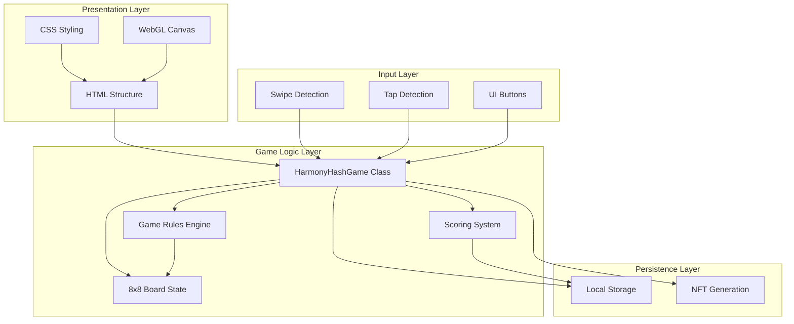
```mermaid
graph TB
    subgraph "Presentation Layer"
        HTML[HTML Structure]
        CSS[CSS Styling]
        Canvas[WebGL Canvas]
    end
    
    subgraph "Game Logic Layer"
        GameClass[HarmonyHashGame Class]
        Board[8x8 Board State]
        Rules[Game Rules Engine]
        Scoring[Scoring System]
    end
    
    subgraph "Input Layer"
        Swipe[Swipe Detection]
        Tap[Tap Detection]
        Buttons[UI Buttons]
    end
    
    subgraph "Persistence Layer"
        LocalStorage[Local Storage]
        NFT[NFT Generation]
    end
    
    HTML --> GameClass
    CSS --> HTML
    Canvas --> HTML
    Swipe --> GameClass
    Tap --> GameClass
    Buttons --> GameClass
    GameClass --> Board
    GameClass --> Rules
    GameClass --> Scoring
    GameClass --> LocalStorage
    GameClass --> NFT
    Rules --> Board
    Scoring --> LocalStorage
```

### 1.2 File Structure Relationships
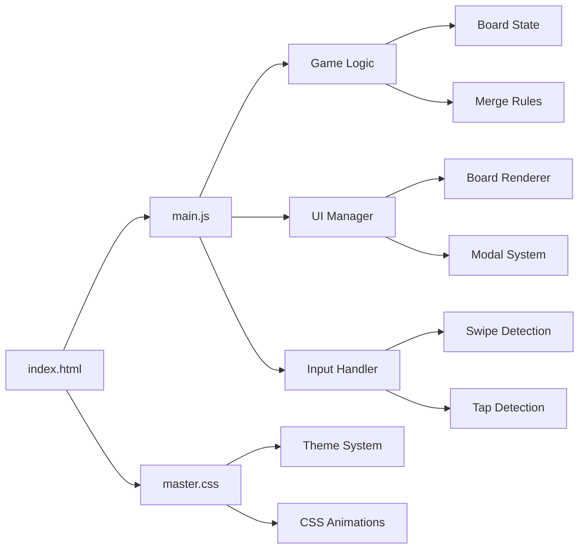
```mermaid
graph LR
    Index[index.html] --> MainJS[main.js]
    Index --> MasterCSS[master.css]
    MainJS --> GameLogic[Game Logic]
    MainJS --> UIManager[UI Manager]
    MainJS --> InputHandler[Input Handler]
    MasterCSS --> Themes[Theme System]
    MasterCSS --> Animations[CSS Animations]
    GameLogic --> BoardState[Board State]
    GameLogic --> MergeRules[Merge Rules]
    UIManager --> Renderer[Board Renderer]
    UIManager --> Modals[Modal System]
    InputHandler --> Swipe[Swipe Detection]
    InputHandler --> Tap[Tap Detection]
```

---

## 2. Core Game Logic Flowcharts

### 2.1 Game Initialization Sequence
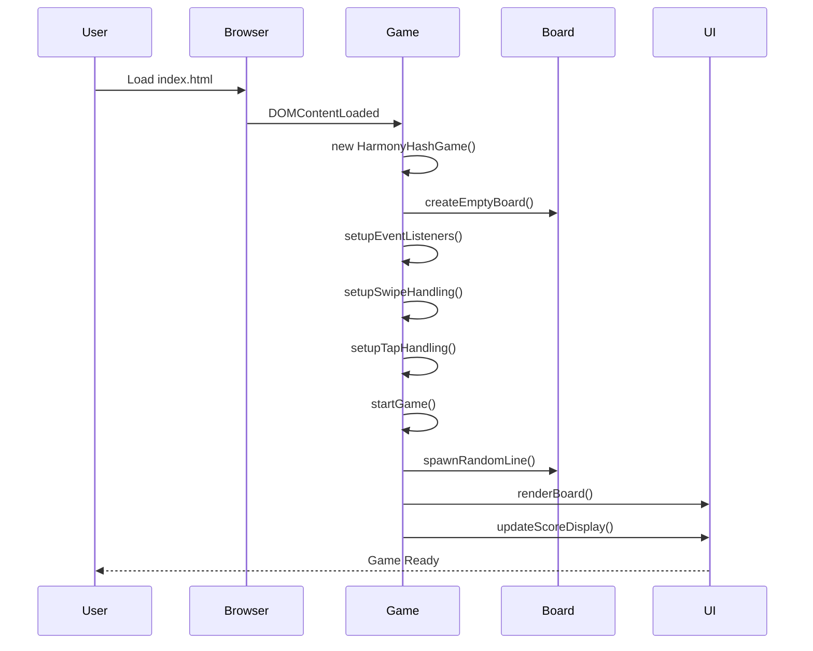
```mermaid
sequenceDiagram
    participant User
    participant Browser
    participant Game
    participant Board
    participant UI
    
    User->>Browser: Load index.html
    Browser->>Game: DOMContentLoaded
    Game->>Game: new HarmonyHashGame()
    Game->>Board: createEmptyBoard()
    Game->>Game: setupEventListeners()
    Game->>Game: setupSwipeHandling()
    Game->>Game: setupTapHandling()
    Game->>Game: startGame()
    Game->>Board: spawnRandomLine()
    Game->>UI: renderBoard()
    Game->>UI: updateScoreDisplay()
    UI-->>User: Game Ready
```

### 2.2 Spawn Mechanics Workflow
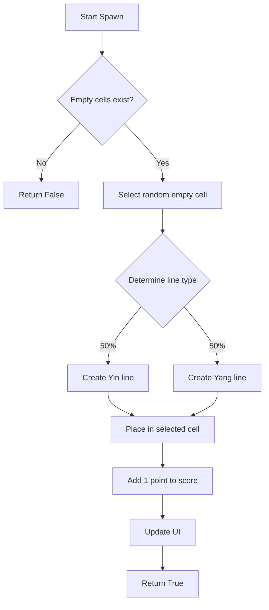
```mermaid
flowchart TD
    Start[Start Spawn] --> CheckEmpty{Empty cells exist?}
    CheckEmpty -->|No| ReturnFalse[Return False]
    CheckEmpty -->|Yes| SelectCell[Select random empty cell]
    SelectCell --> DetermineType{Determine line type}
    DetermineType -->|50%| Yin[Create Yin line]
    DetermineType -->|50%| Yang[Create Yang line]
    Yin --> PlaceCell[Place in selected cell]
    Yang --> PlaceCell
    PlaceCell --> AddScore[Add 1 point to score]
    AddScore --> UpdateUI[Update UI]
    UpdateUI --> ReturnTrue[Return True]
```

### 2.3 Movement/Swipe Processing Algorithm
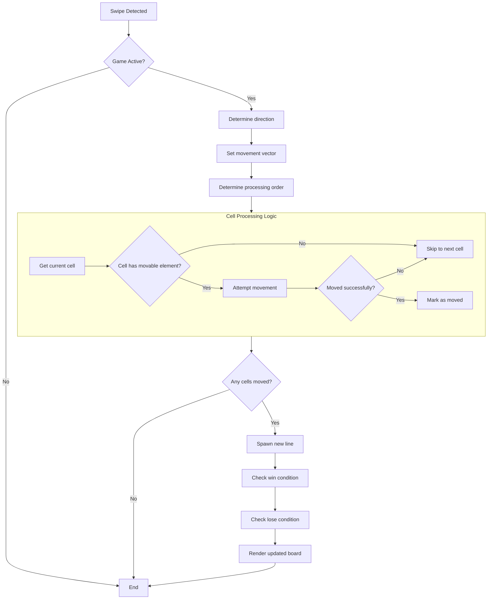
```mermaid
flowchart TD
    Start[Swipe Detected] --> CheckActive{Game Active?}
    CheckActive -->|No| End[End]
    CheckActive -->|Yes| DetermineDir[Determine direction]
    DetermineDir --> SetVector[Set movement vector]
    SetVector --> DetermineOrder[Determine processing order]
    DetermineOrder --> ProcessCells[Process cells in order]
    
    subgraph ProcessCells [Cell Processing Logic]
        PC1[Get current cell] --> PC2{Cell has movable element?}
        PC2 -->|No| PC3[Skip to next cell]
        PC2 -->|Yes| PC4[Attempt movement]
        PC4 --> PC5{Moved successfully?}
        PC5 -->|Yes| PC6[Mark as moved]
        PC5 -->|No| PC3
    end
    
    ProcessCells --> AnyMoved{Any cells moved?}
    AnyMoved -->|No| End
    AnyMoved -->|Yes| SpawnNew[Spawn new line]
    SpawnNew --> CheckWin[Check win condition]
    CheckWin --> CheckLose[Check lose condition]
    CheckLose --> Render[Render updated board]
    Render --> End
```

### 2.4 Merge Logic Decision Tree
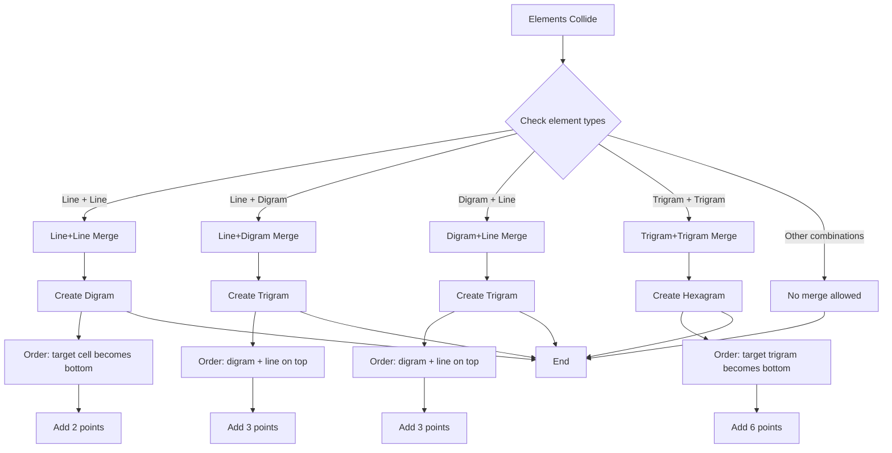
```mermaid
flowchart TD
    Start[Elements Collide] --> CheckTypes{Check element types}
    
    CheckTypes -->|Line + Line| LL[Line+Line Merge]
    LL --> CreateDigram[Create Digram]
    CreateDigram --> OrderLL[Order: target cell becomes bottom]
    OrderLL --> Points2[Add 2 points]
    
    CheckTypes -->|Line + Digram| LD[Line+Digram Merge]
    LD --> CreateTrigram[Create Trigram]
    CreateTrigram --> OrderLD[Order: digram + line on top]
    OrderLD --> Points3[Add 3 points]
    
    CheckTypes -->|Digram + Line| DL[Digram+Line Merge]
    DL --> CreateTrigram2[Create Trigram]
    CreateTrigram2 --> OrderDL[Order: digram + line on top]
    OrderDL --> Points3_2[Add 3 points]
    
    CheckTypes -->|Trigram + Trigram| TT[Trigram+Trigram Merge]
    TT --> CreateHexagram[Create Hexagram]
    CreateHexagram --> OrderTT[Order: target trigram becomes bottom]
    OrderTT --> Points6[Add 6 points]
    
    CheckTypes -->|Other combinations| NoMerge[No merge allowed]
    
    CreateDigram --> End[End]
    CreateTrigram --> End
    CreateTrigram2 --> End
    CreateHexagram --> End
    NoMerge --> End
```

### 2.5 Fixation/Unique Constraint Validation
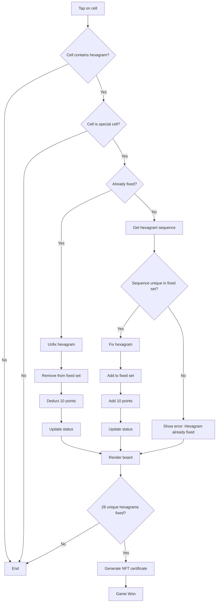
```mermaid
flowchart TD
    Start[Tap on cell] --> CheckHexagram{Cell contains hexagram?}
    CheckHexagram -->|No| End[End]
    CheckHexagram -->|Yes| CheckSpecial{Cell is special cell?}
    CheckSpecial -->|No| End
    CheckSpecial -->|Yes| CheckFixed{Already fixed?}
    CheckFixed -->|Yes| Unfix[Unfix hexagram]
    Unfix --> RemoveFromSet[Remove from fixed set]
    RemoveFromSet --> DeductPoints[Deduct 10 points]
    DeductPoints --> UpdateStatus[Update status]
    
    CheckFixed -->|No| GetSequence[Get hexagram sequence]
    GetSequence --> CheckUnique{Sequence unique in fixed set?}
    CheckUnique -->|No| ShowError[Show error: Hexagram already fixed]
    CheckUnique -->|Yes| Fix[Fix hexagram]
    Fix --> AddToSet[Add to fixed set]
    AddToSet --> AddPoints[Add 10 points]
    AddPoints --> UpdateStatus2[Update status]
    
    UpdateStatus --> Render[Render board]
    UpdateStatus2 --> Render
    ShowError --> Render
    Render --> CheckWin{28 unique hexagrams fixed?}
    CheckWin -->|Yes| GenerateNFT[Generate NFT certificate]
    CheckWin -->|No| End
    GenerateNFT --> Win[Game Won]
```

### 2.6 Win/Lose Condition Evaluation
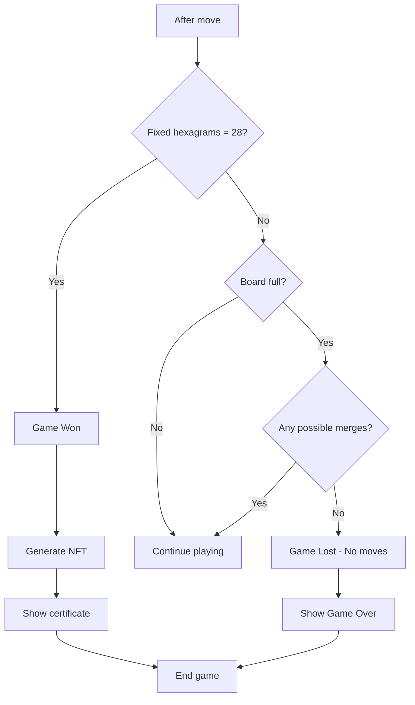
```mermaid
flowchart TD
    Start[After move] --> CheckWin{Fixed hexagrams = 28?}
    CheckWin -->|Yes| Win[Game Won]
    CheckWin -->|No| CheckBoard{Board full?}
    CheckBoard -->|No| Continue[Continue playing]
    CheckBoard -->|Yes| CheckMerges{Any possible merges?}
    CheckMerges -->|Yes| Continue
    CheckMerges -->|No| Lose[Game Lost - No moves]
    
    Win --> GenerateNFT[Generate NFT]
    GenerateNFT --> ShowCertificate[Show certificate]
    ShowCertificate --> EndGame[End game]
    
    Lose --> ShowMessage[Show Game Over]
    ShowMessage --> EndGame
```

---

## 3. UI Component Diagrams

### 3.1 Visual Layout Hierarchy
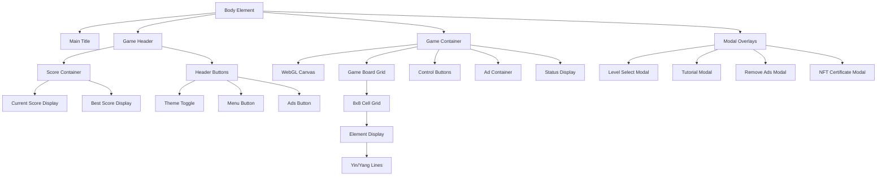
```mermaid
graph TB
    Body[Body Element] --> Title[Main Title]
    Body --> Header[Game Header]
    Body --> Container[Game Container]
    Body --> Modals[Modal Overlays]
    
    Header --> ScoreContainer[Score Container]
    Header --> HeaderButtons[Header Buttons]
    
    ScoreContainer --> CurrentScore[Current Score Display]
    ScoreContainer --> BestScore[Best Score Display]
    
    HeaderButtons --> ThemeToggle[Theme Toggle]
    HeaderButtons --> MenuButton[Menu Button]
    HeaderButtons --> AdsButton[Ads Button]
    
    Container --> Canvas[WebGL Canvas]
    Container --> GameBoard[Game Board Grid]
    Container --> Controls[Control Buttons]
    Container --> AdContainer[Ad Container]
    Container --> Status[Status Display]
    
    GameBoard --> Cell[8x8 Cell Grid]
    Cell --> Element[Element Display]
    Element --> Lines[Yin/Yang Lines]
    
    Modals --> LevelSelect[Level Select Modal]
    Modals --> Tutorial[Tutorial Modal]
    Modals --> RemoveAds[Remove Ads Modal]
    Modals --> NFTModal[NFT Certificate Modal]
```

### 3.2 Interactive Elements State Transitions
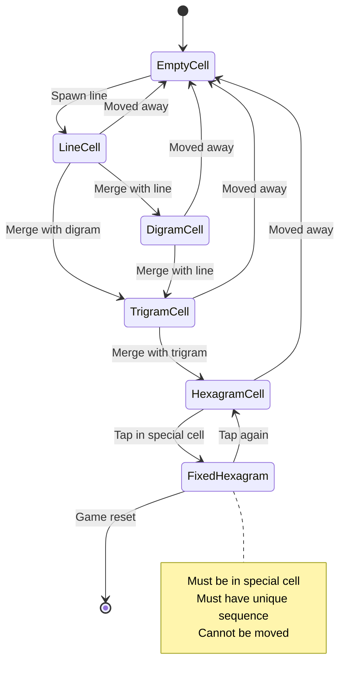
```mermaid
stateDiagram-v2
    [*] --> EmptyCell
    EmptyCell --> LineCell : Spawn line
    LineCell --> EmptyCell : Moved away
    LineCell --> DigramCell : Merge with line
    LineCell --> TrigramCell : Merge with digram
    
    DigramCell --> EmptyCell : Moved away
    DigramCell --> TrigramCell : Merge with line
    
    TrigramCell --> EmptyCell : Moved away
    TrigramCell --> HexagramCell : Merge with trigram
    
    HexagramCell --> EmptyCell : Moved away
    HexagramCell --> FixedHexagram : Tap in special cell
    
    FixedHexagram --> HexagramCell : Tap again
    FixedHexagram --> [*] : Game reset
    
    note right of FixedHexagram
        Must be in special cell
        Must have unique sequence
        Cannot be moved
    end note
```

### 3.3 Theme Switching Mechanism
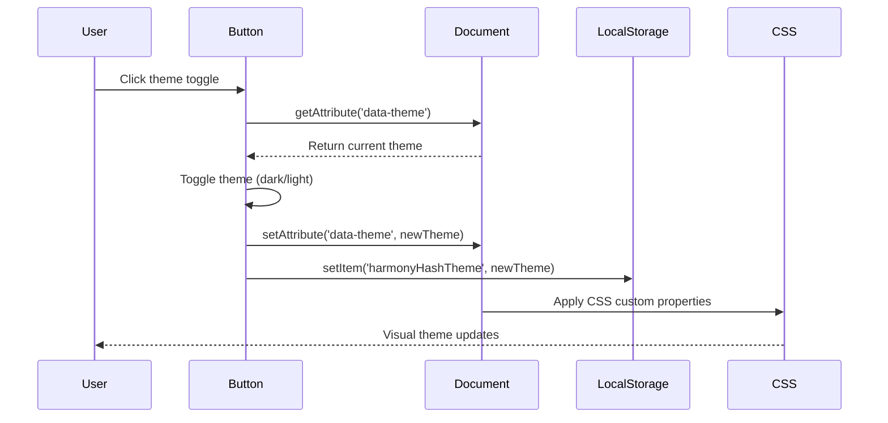
```mermaid
sequenceDiagram
    participant User
    participant Button
    participant Document
    participant LocalStorage
    participant CSS
    
    User->>Button: Click theme toggle
    Button->>Document: getAttribute('data-theme')
    Document-->>Button: Return current theme
    Button->>Button: Toggle theme (dark/light)
    Button->>Document: setAttribute('data-theme', newTheme)
    Button->>LocalStorage: setItem('harmonyHashTheme', newTheme)
    Document->>CSS: Apply CSS custom properties
    CSS-->>User: Visual theme updates
```

---

## 4. State Management Diagrams

### 4.1 Game State Machine
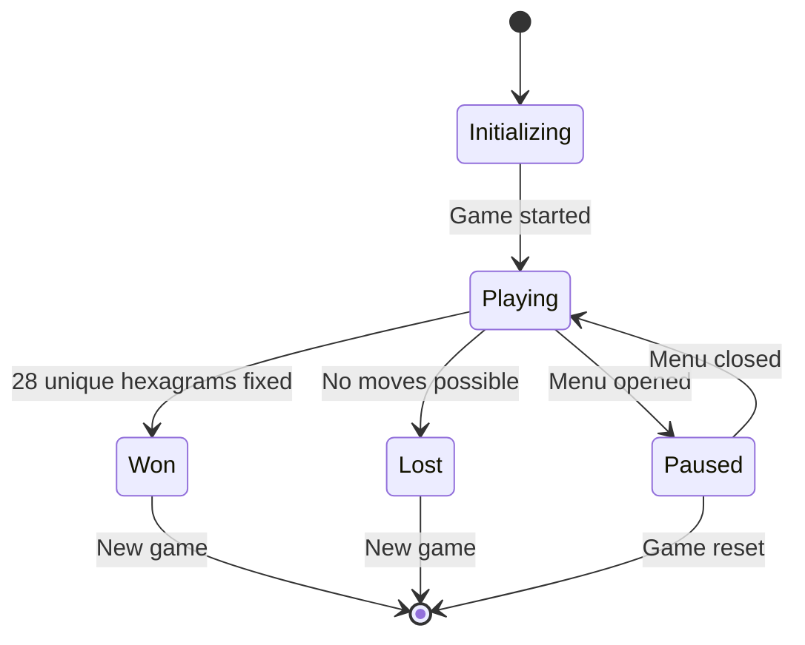
```mermaid
stateDiagram-v2
    [*] --> Initializing
    Initializing --> Playing : Game started
    Playing --> Paused : Menu opened
    Paused --> Playing : Menu closed
    Playing --> Won : 28 unique hexagrams fixed
    Playing --> Lost : No moves possible
    Won --> [*] : New game
    Lost --> [*] : New game
    Paused --> [*] : Game reset
```

### 4.2 Board Cell State Transitions
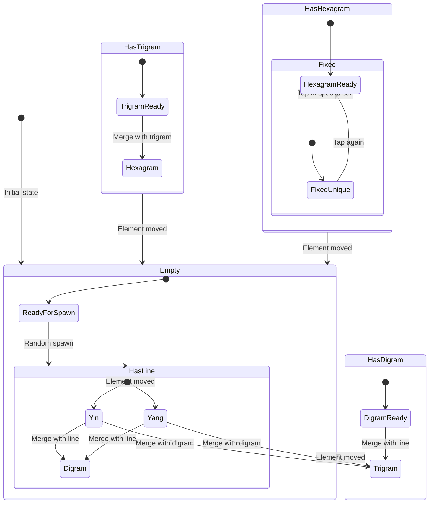
```mermaid
stateDiagram-v2
    [*] --> Empty : Initial state
    
    state Empty {
        [*] --> ReadyForSpawn
        ReadyForSpawn --> HasLine : Random spawn
    }
    
    state HasLine {
        [*] --> Yin
        [*] --> Yang
        Yin --> Digram : Merge with line
        Yang --> Digram : Merge with line
        Yin --> Trigram : Merge with digram
        Yang --> Trigram : Merge with digram
    }
    
    state HasDigram {
        [*] --> DigramReady
        DigramReady --> Trigram : Merge with line
    }
    
    state HasTrigram {
        [*] --> TrigramReady
        TrigramReady --> Hexagram : Merge with trigram
    }
    
    state HasHexagram {
        [*] --> HexagramReady
        HexagramReady --> Fixed : Tap in special cell
    }
    
    state Fixed {
        [*] --> FixedUnique
        FixedUnique --> HexagramReady : Tap again
    }
    
    Empty --> HasLine
    HasLine --> Empty : Element moved
    HasDigram --> Empty : Element moved
    HasTrigram --> Empty : Element moved
    HasHexagram --> Empty : Element moved
```

### 4.3 Score and Progress Tracking Flow
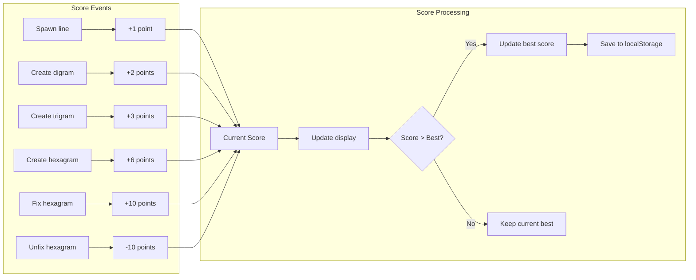
```mermaid
flowchart LR
    subgraph "Score Events"
        SpawnLine[Spawn line] --> +1[+1 point]
        CreateDigram[Create digram] --> +2[+2 points]
        CreateTrigram[Create trigram] --> +3[+3 points]
        CreateHexagram[Create hexagram] --> +6[+6 points]
        FixHexagram[Fix hexagram] --> +10[+10 points]
        UnfixHexagram[Unfix hexagram] --> -10[-10 points]
    end
    
    subgraph "Score Processing"
        CurrentScore[Current Score] --> Update[Update display]
        Update --> CheckBest{Score > Best?}
        CheckBest -->|Yes| UpdateBest[Update best score]
        CheckBest -->|No| Skip[Keep current best]
        UpdateBest --> Save[Save to localStorage]
    end
    
    +1 --> CurrentScore
    +2 --> CurrentScore
    +3 --> CurrentScore
    +6 --> CurrentScore
    +10 --> CurrentScore
    -10 --> CurrentScore
```

---

## 5. Data Flow Diagrams

### 5.1 Player Input → Game State → UI Rendering
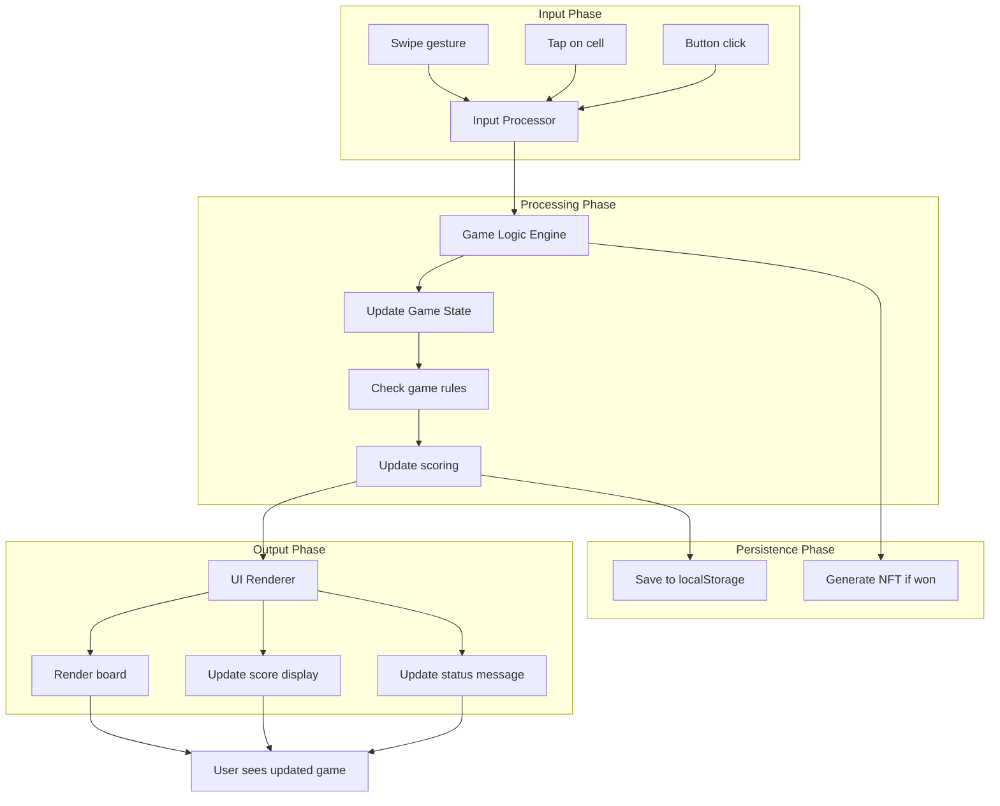
```mermaid
flowchart TD
    subgraph "Input Phase"
        Swipe[Swipe gesture] --> InputProcessor[Input Processor]
        Tap[Tap on cell] --> InputProcessor
        Button[Button click] --> InputProcessor
    end
    
    subgraph "Processing Phase"
        InputProcessor --> GameLogic[Game Logic Engine]
        GameLogic --> StateUpdate[Update Game State]
        StateUpdate --> RuleCheck[Check game rules]
        RuleCheck --> ScoreUpdate[Update scoring]
    end
    
    subgraph "Output Phase"
        ScoreUpdate --> UIRenderer[UI Renderer]
        UIRenderer --> BoardRender[Render board]
        UIRenderer --> ScoreDisplay[Update score display]
        UIRenderer --> StatusUpdate[Update status message]
    end
    
    subgraph "Persistence Phase"
        ScoreUpdate --> LocalStorage[Save to localStorage]
        GameLogic --> NFTGenerator[Generate NFT if won]
    end
    
    BoardRender --> User[User sees updated game]
    ScoreDisplay --> User
    StatusUpdate --> User
```

### 5.2 NFT Certificate Generation Process
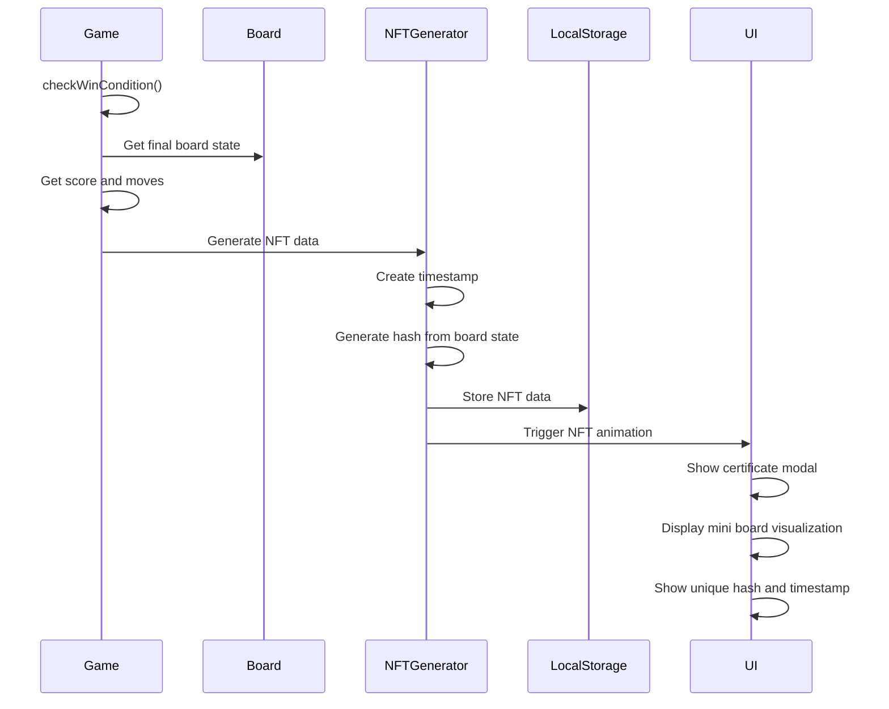
```mermaid
sequenceDiagram
    participant Game
    participant Board
    participant NFTGenerator
    participant LocalStorage
    participant UI
    
    Game->>Game: checkWinCondition()
    Game->>Board: Get final board state
    Game->>Game: Get score and moves
    Game->>NFTGenerator: Generate NFT data
    NFTGenerator->>NFTGenerator: Create timestamp
    NFTGenerator->>NFTGenerator: Generate hash from board state
    NFTGenerator->>LocalStorage: Store NFT data
    NFTGenerator->>UI: Trigger NFT animation
    UI->>UI: Show certificate modal
    UI->>UI: Display mini board visualization
    UI->>UI: Show unique hash and timestamp
```

### 5.3 Local Storage Persistence Flow
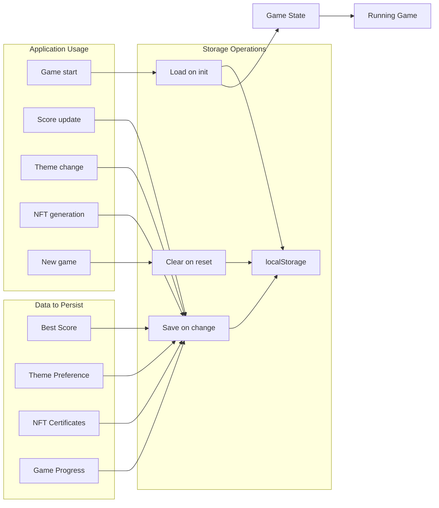
```mermaid
flowchart LR
    subgraph "Data to Persist"
        BestScore[Best Score]
        ThemePreference[Theme Preference]
        NFTData[NFT Certificates]
        GameProgress[Game Progress]
    end
    
    subgraph "Storage Operations"
        Save[Save on change] --> LocalStorage[localStorage]
        Load[Load on init] --> LocalStorage
        Clear[Clear on reset] --> LocalStorage
    end
    
    subgraph "Application Usage"
        GameStart[Game start] --> Load
        ScoreUpdate[Score update] --> Save
        ThemeChange[Theme change] --> Save
        NFTGeneration[NFT generation] --> Save
        NewGame[New game] --> Clear
    end
    
    BestScore --> Save
    ThemePreference --> Save
    NFTData --> Save
    GameProgress --> Save
    
    Load --> GameState[Game State]
    GameState --> GameRunning[Running Game]
```

---

## 6. Special Rules Visualization

### 6.1 Special Cell Pattern (Hash-shaped 28 cells)
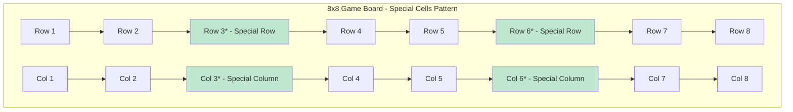
```mermaid
graph TD
    subgraph "8x8 Game Board - Special Cells Pattern"
        R1[Row 1] --> R2[Row 2]
        R2 --> R3[Row 3* - Special Row]
        R3 --> R4[Row 4]
        R4 --> R5[Row 5]
        R5 --> R6[Row 6* - Special Row]
        R6 --> R7[Row 7]
        R7 --> R8[Row 8]
        
        C1[Col 1] --> C2[Col 2]
        C2 --> C3[Col 3* - Special Column]
        C3 --> C4[Col 4]
        C4 --> C5[Col 5]
        C5 --> C6[Col 6* - Special Column]
        C6 --> C7[Col 7]
        C7 --> C8[Col 8]
    end
    
    style R3 fill:#00a0a040
    style R6 fill:#00a0a040
    style C3 fill:#00a0a040
    style C6 fill:#00a0a040
```

### 6.2 Unique Hexagram Constraint
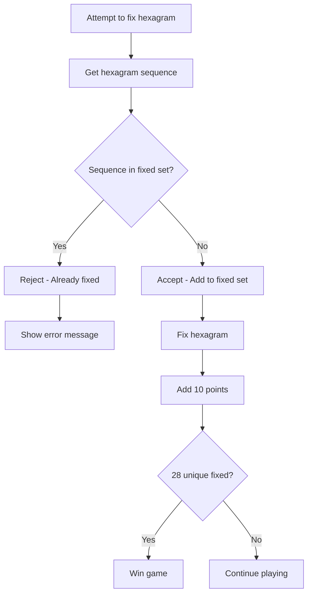
```mermaid
flowchart TD
    Start[Attempt to fix hexagram] --> GetSequence[Get hexagram sequence]
    GetSequence --> CheckSet{Sequence in fixed set?}
    CheckSet -->|Yes| Reject[Reject - Already fixed]
    CheckSet -->|No| Accept[Accept - Add to fixed set]
    Reject --> ShowError[Show error message]
    Accept --> Fix[Fix hexagram]
    Fix --> UpdateScore[Add 10 points]
    UpdateScore --> CheckWin{28 unique fixed?}
    CheckWin -->|Yes| Win[Win game]
    CheckWin -->|No| Continue[Continue playing]
```

### 6.3 Merge Ordering Rules

```mermaid
graph TD
    subgraph "Swipe Direction: UP"
        Up1[Element A - Higher row] --> Up2[Element B - Lower row]
        Up2 --> Up3[A contributes to BOTTOM]
        Up3 --> Up4[B contributes to TOP]
    end
    
    subgraph "Swipe Direction: DOWN"
        Down1[Element A - Lower row] --> Down2[Element B - Higher row]
        Down2 --> Down3[A contributes to BOTTOM]
        Down3 --> Down4[B contributes to TOP]
    end
    
    subgraph "Swipe Direction: LEFT"
        Left1[Element A - Right column] --> Left2[Element B - Left column]
        Left2 --> Left3[A contributes to BOTTOM]
        Left3 --> Left4[B contributes to TOP]
    end
    
    subgraph "Swipe Direction: RIGHT"
        Right1[Element A - Left column] --> Right2[Element B - Right column]
        Right2 --> Right3[A contributes to BOTTOM]
        Right3 --> Right4[B contributes to TOP]
    end
    
    style Up3 fill:#a0e0a0
    style Down3 fill:#a0e0a0
    style Left3 fill:#a0e0a0
    style Right3 fill:#a0e0a0
```

---

## 7. Conclusion

### 7.1 IP Protection Summary
The Harmony Hash game system represents a unique combination of mechanics that together form an original work eligible for copyright protection:

1. **Original Game Board Structure**: 8x8 grid with hash-shaped special cell pattern
2. **Unique Symbolic System**: Yin/Yang lines forming digrams, trigrams, and hexagrams
3. **Novel Merge Mechanics**: Restricted merge combinations with deterministic ordering
4. **Special Fixation Rules**: Hexagrams can only be fixed in special cells with uniqueness constraint
5. **Integrated NFT Generation**: Game completion generates unique cryptographic certificates

### 7.2 System Uniqueness
The originality arises from the precise interaction of:
- Board topology (special cell arrangement)
- Merge logic (restricted combinations)
- Ordering rules (spatial proximity determination)
- Fixation mechanics (special cells only)
- Uniqueness constraints (no duplicate hexagrams)
- Symbolic representation (yin/yang line system)

### 7.3 Documentation Purpose
This Mermaid diagram documentation serves as:
1. **Technical Specification**: Clear visual representation of game mechanics
2. **IP Evidence**: Demonstrates the original combination of elements
3. **Development Guide**: Reference for implementation and maintenance
4. **Legal Protection**: Supports copyright claims through detailed documentation

---

## 8 Legal Considerations
- This documentation is part of the Harmony Hash copyright deposit
- Diagrams illustrate the original creative expression
- Diagrams do not limit future artistic ensembles of the original creative expression
  
---

**Document Version**: 1.0  
**Last Updated**: December 17, 2025  
**Game Version**: Harmony Hash v1.0  
**Author**: Alexandre Michel Gavronski  
**Copyright**: © 2025 All Rights Reserved

*This document and the diagrams herein are part of the Harmony Hex copyright deposit and should be maintained as evidence of the original creative work.*
